# 什么是yolo?能用来做什么？

yolo是一套成熟的开源的深度学习框架，可以实现目标检测、分割、姿态估计、跟踪和分类等功能。官网地址：https://docs.ultralytics.com/ ，github地址：https://github.com/ultralytics/yolov5/tree/v7.0
# 相关技术准备
## 1.运行环境准备
### 1.1本地搭建
推荐电脑配置非常不错的小伙伴，本地搭建，首先要安装【anaconda】，它是一个开源的Python发行版本，可以支持包管理，快速各种虚拟环境等，下载地址：https://www.anaconda.com/download/success ，找到对应版本进行下载即可

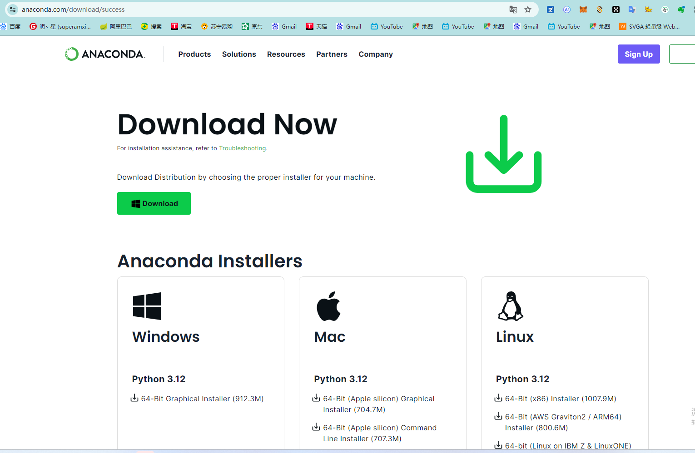

<font color="red">安装教程参考：https://blog.csdn.net/weixin_43715458/article/details/100096496</font>  

安装完成之后，执行anaconda -V,检测是否安装成功,安装成功会打印版本号
```shell
conda -V
```
然后就是创建虚拟环境，执行命令如下，我们是基于python 3.8,可以通过如下命令创建虚拟环境，

```shell
conda create --name dnf python=3.8
```
然后切换到dnf虚拟环境中
```shell
conda activate dnf
```
### 1.2使用云服务
推荐没有本地硬件环境的小伙伴使用deepln：[https://www.deepln.com/](https://funhpc.com/#/user/regist?Code=ZnVuLWhwY7u-hF30KMxsDhDUKy89OsRU_biHphWCDfmCiQ2ESSm0) ，可直接使用，而且非常便宜。

### 1.3安装pytorch

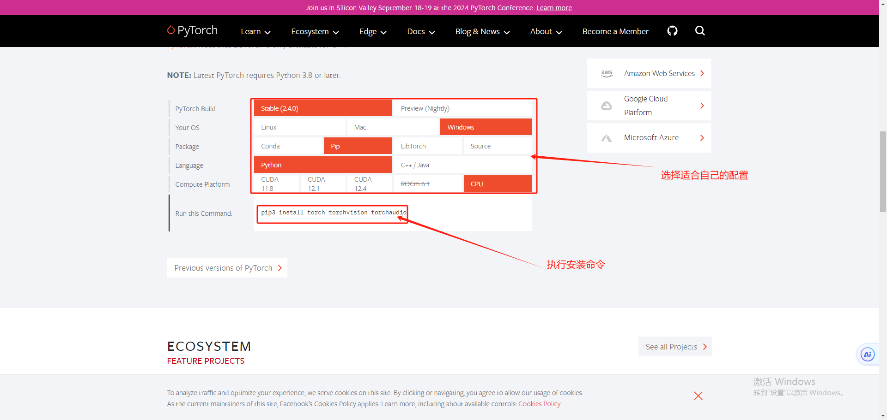

***

## 2.下载源码及依赖安装
### 2.1下载yolov5.7.0源代码
yolov5.7.0版本，目前已经发展到V10了，具体新特性大家自行研究，v5.7.0版本下载地址：https://github.com/ultralytics/yolov5/tree/v7.0 ，将压缩包解压到本地，windows和mac用户自行使用解压软件进行解压即可，如果是使用linux的云服务，可执行如下命令进行解压就可以了
```
unzip yolov5-7.0.zip
```
解压完成，然后进入到yolov5-7.0的目录下,然后执行如下命令安装依赖，等待安装完成即可
```
pip install -i https://mirrors.aliyun.com/pypi/simple/ -r requirements.txt
```

***
### 2.2下载权重文件并进行测试
yolo提供了一些预训练的模型，可以直接下载使用，下载地址：https://github.com/ultralytics/yolov5/releases/download/v7.0/yolov5s.pt ， 下载好权重文件，将yolov5s.pt这个文件放入到yolov5-7.0目录下，然后可以执行如下命令进行测试
```
python detect.py --weights yolov5s.pt --source data\images
```
执行完成之后，应该可以在runs\detect\exp目录下找到检测好的图片

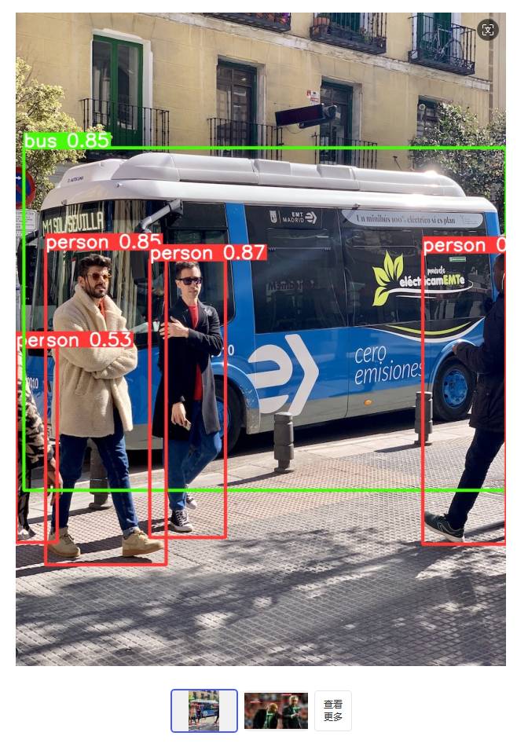
### 2.2安装labelImg
这个是一个打标签的工具，帮助我们进行数据分类和标记准备，安装命令如下：
```shell
pip install -i https://mirrors.aliyun.com/pypi/simple/ labelImg
```
# 模型训练
## 1.训练数据准备
### 1.1 创建标准训练数据目录
官方给出的标准训练目录如下，大家需要准备好如下目录的一个结构,创建<font color="red">**yolov5-7.0目录下**</font>  
```
dnf
--train #训练文件目录
----images
----labels
--val #验证文件目录
----images
----labels
--test #测试文件目录
--dnf.yaml
```
其中dnf.yaml定义训练参数，详细可参考官方介绍，其结构参考如下
```yaml
names: 
  0: me

train: 
  - dnf/train/images
val: 
  - dnf/val/images
```
### 1.2 准备训练数据
训练需要不少数据，可以通过手机截屏的方式，当然这里推荐使用录屏，然后截取帧画面来作为训练素材，<font color="red">**录制好视频之后**</font> ，可通过如下python脚本来实现帧画面的提取,如果大家执行报错，那么说明缺少依赖包，直接百度搜索通过pip安装解决即可
```python
import cv2
import os
def video_to_frames_every_n(video_path, output_directory, frame_interval):
    cap = cv2.VideoCapture(video_path)
    if not os.path.exists(output_directory):
        os.makedirs(output_directory)
    frame_count = 0
    frame_id = 0
    while True:
        ret, frame = cap.read()
        if not ret:
            break
        frame_count += 1
        if frame_count % frame_interval == 0:
            cv2.imwrite(os.path.join(output_directory, f"gjs{frame_id:06d}.jpg"), frame)
            frame_id += 1
    cap.release()
    print(f"Frames saved to {output_directory}")
video_path = "gjs.mp4"  # 替换为你的视频文件路径
output_directory = "images"  # 输出的图片将保存在这个目录下
frame_interval = 25  # 每25帧取一张图片，可视情况调整
video_to_frames_every_n(video_path, output_directory, frame_interval)
```
执行上述python代码完成之后，就得到一张张的训练图片数据，然后就可以对这些图片进行处理了

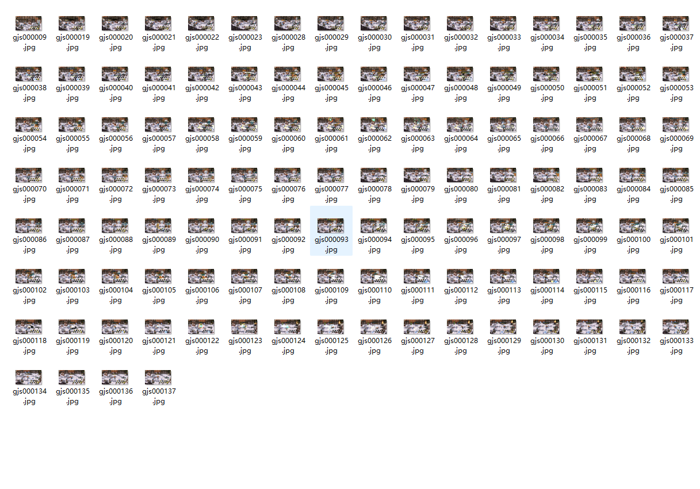
### 1.3使用labelImg进行数据打标
按照上一个步骤，已经将视频切割并放入到images目录下，我们再建一个labels目录用于存放标签，然后执行如下命令打开labelImg
```
labelImg
```
打开之后进行如下操作，设置图片目录和标签目录
+ 点击左侧【Open Dir】选择images目录
+ 点击左侧【Change Save Dir】选择新创建的labels目录
+ 点击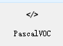，切换至yolo模式
+ 点击菜单栏【View】，然后选择【Auto Save Model】，自动保存

做完上述操作和设置之后就可以对图片做标记了，快捷键为【W】，然后就会出现一个矩形选择框，通过鼠标拖动选择识别的目标区域，然后设置标签（这里我们只设置一个me标签，需要和dnf.yaml中定义的标签对应），依次对所有图片进行上述操作就可以

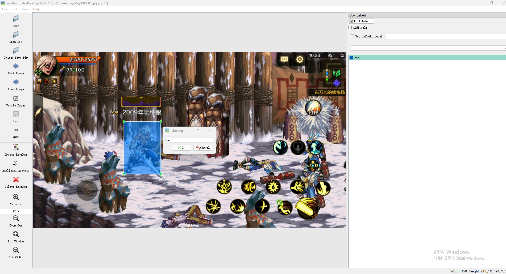

标记完所有的图片之后，大家可以看到labels目标下多了很多文件，这个就是我们标记好的标签文件，标签文件名称和图片文件一一对应

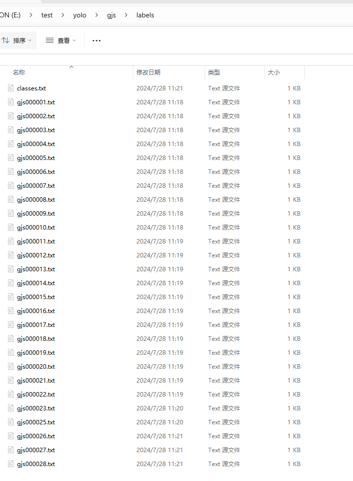

做好上述准备之后，我们按照大概8:2的比例，将images和labels目前下的文件分别移动到之后创建的dnf的train和val对应的images和labels下，这样我们的训练数据就准备好了
### 1.4开始数据训练
我们进入到yolov5-7.0目录下，再核对一下文件是否放对目录，以避免各种错误问题

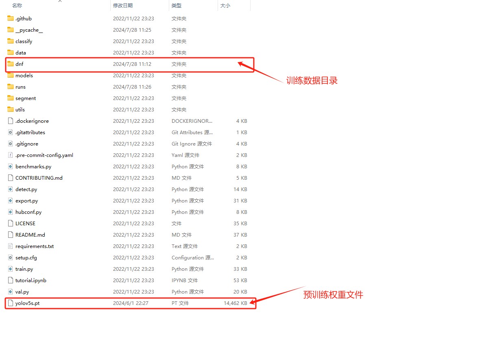

然后执行如下命令,具体参数大家请参考官方文档，数据训练需要不错的硬件环境，否则会非常慢
```shell
python train.py --weights=yolov5s.pt --data=dnf/dnf.yaml --batch-size=16 --epochs=200
```
执行完成之后，会打印出我们训练的结果，可以看到结果保存到runs/train/exp6

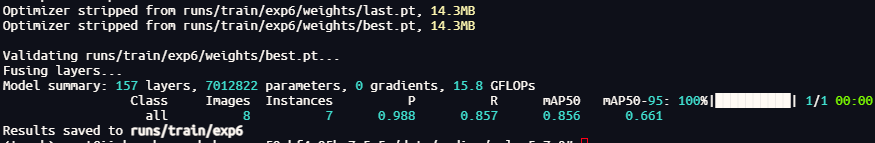
### 1.5测试训练训练结果
我们打开runs/train/exp6/weights目录下，找到best.pt，这个就是我们训练好的权重文件，我们可以用如下命令进行权重文件测试
```shell
python detect.py --source dnf/val/images/ --weights runs/train/exp6/weights/best.pt
```
然后可以看到执行结果如下，识别结果保存在runs/detect/exp4目录下

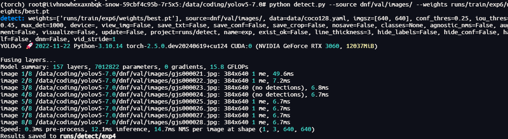

我们打开runs/detect/exp4可以看到识别的结果文件

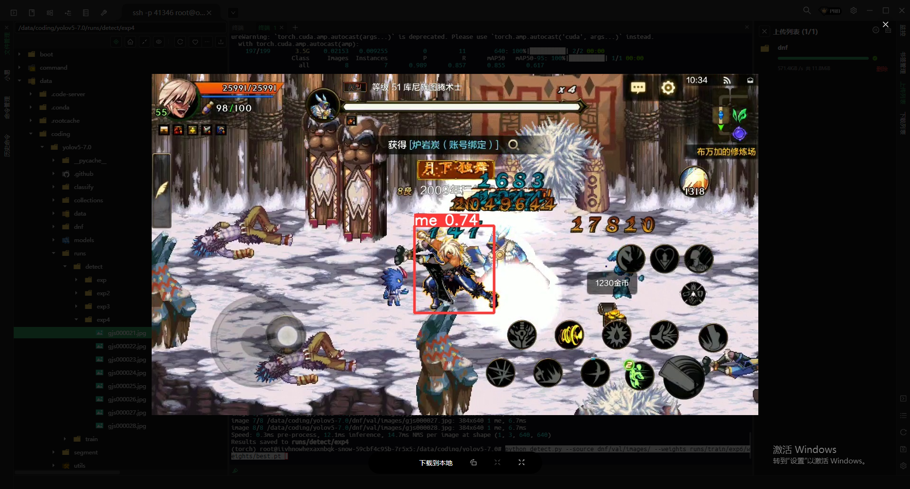

# 总结
OK，大功告成，我们成功训练出了一个可以识别DNFM鬼剑士的模型，更多复杂的模型以及优化我们后续再介绍。感兴趣的同学可以添加如下群
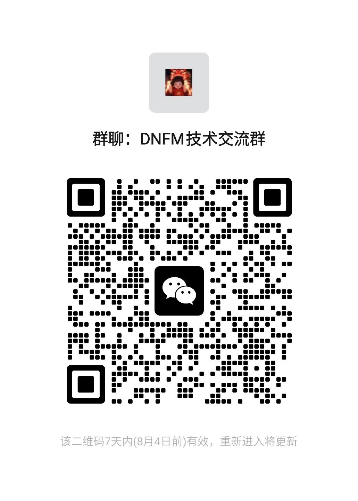
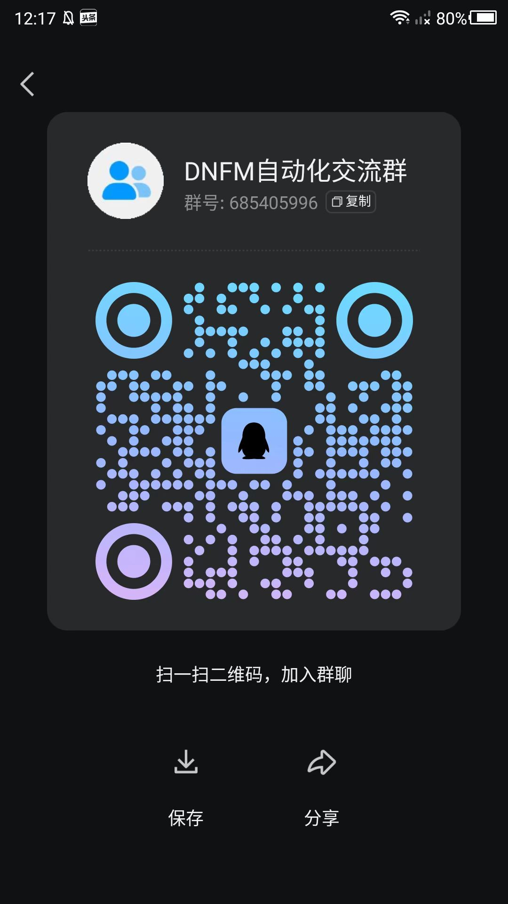
